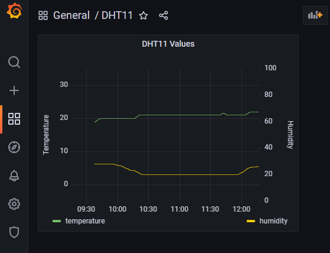

# Containerized DHT Reader

This is a small project to poll a DHT11/DHT22 temperature sensor and store the results in a PostgreSQL database.
Docker must be installed.
To build the containers, run `create_temperature_setup.sh`.

The script will create

- 3 Docker images `dht_db`, `dht_reader`, `dht_grafana`
- 1 Docker network `temperature`
- 3 Docker containers `dht_db`, `dht_reader`, `dht_grafana`

## Change Sensor and Pin

Depending on the wiring and sensor, change `python_polling/dht/dhtsensor.py` on line 23.

## Access Grafana

Grafana can be accessed at `{host}:80`.
The credentials are the default user and password (`admin` each).